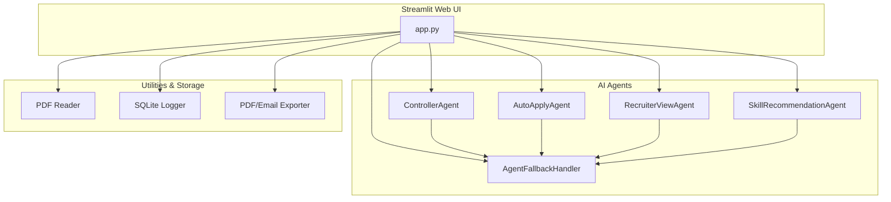

# JobSniper AI – Professional Resume & Career Intelligence Platform

---

## 🏗️ System Architecture

### High-Level Architecture



> **Tip:** If viewing this on GitHub and the diagram does not render, you can copy the code above to [Mermaid Live Editor](https://mermaid.live/) to view and export the image, or use a Markdown viewer with Mermaid support.

---

JobSniper AI is a modern, modular, and scalable AI-powered resume analysis and career intelligence platform. It leverages multiple AI providers, robust PDF parsing, and a clean Streamlit UI to deliver actionable insights for job seekers and recruiters.

## 🚀 Features
- **Multi-AI Support:** Google Gemini (primary), Mistral AI (fallback), and Demo Mode
- **Resume Analysis:** Intelligent parsing, skill extraction, and feedback
- **Job Matching:** Smart skill/job alignment and scoring
- **Resume Tailoring:** Personalized improvement suggestions
- **Job Description Generation:** AI-powered, role-specific JDs
- **Export & Email:** PDF reports and email delivery
- **HR/Recruiter Tools:** Candidate evaluation and analytics
- **Skill Development:** Gap analysis and personalized learning roadmap

---

## Component Breakdown

### 1. UI Layer (Streamlit)
- `ui/app.py`: Main entry point, handles all user interaction, navigation, and visualization.
- Responsive dashboard for job seekers and recruiters.
- Uploads resumes, triggers analysis, and displays results.

### 2. AI Agents Layer
- `agents/controller_agent.py`: Orchestrates resume analysis and job matching.
- `agents/auto_apply_agent.py`: Automates job application generation.
- `agents/recruiter_view_agent.py`: HR/recruiter candidate evaluation.
- `agents/skill_recommendation_agent.py`: Skill gap analysis and learning roadmap.
- `agents/agent_fallback.py`: Provides robust fallback logic and demo data.

### 3. Utilities & Storage
- `utils/pdf_reader.py`: Extracts text from PDF resumes.
- `utils/sqlite_logger.py`: Logs user actions and analysis history.
- `utils/exporter.py`: Generates PDF reports and handles email delivery.
- `utils/config.py`: Loads API keys and environment settings.

---

## Data Flow
1. **User uploads resume** via UI.
2. **PDF Reader** extracts text.
3. **Controller Agent** (or fallback) analyzes resume, matches skills, and generates feedback.
4. **Results** are displayed in the UI and can be exported/emailed.
5. **Skill Agent** provides gap analysis and learning roadmap.
6. **Recruiter Agent** enables HR evaluation workflows.

---

## 🛠️ Installation
1. **Clone the repository**
   ```bash
   git clone <your-repo-url>
   cd job-snipper-ai
   ```
2. **Install dependencies**
   ```bash
   pip install -r requirements.txt
   ```
3. **Configure API Keys**
   - Copy `.env.example` to `.env` and fill in your API keys and email credentials.

---

## 🔑 API & Email Configuration
- **Google Gemini**: [Get API Key](https://aistudio.google.com/app/apikey)
- **Mistral AI**: [Get API Key](https://console.mistral.ai/)
- **Email (Gmail recommended)**: Enable 2FA, create an App Password, and set `SENDER_EMAIL`/`SENDER_PASSWORD` in `.env`.

---

## 🎯 Usage
- **Run the app:**
  ```bash
  streamlit run ui/app.py
  ```
- **Demo Mode:**
  - Works without API keys using realistic mock data.
- **Production:**
  - Add your API keys and email credentials to `.env` for full functionality.

---

## 📁 Project Structure
```
job-snipper-ai/
├── agents/                 # AI agents
│   ├── controller_agent.py
│   ├── auto_apply_agent.py
│   ├── recruiter_view_agent.py
│   ├── skill_recommendation_agent.py
│   └── agent_fallback.py
├── ui/
│   └── app.py             # Streamlit interface
├── utils/
│   ├── config.py
│   ├── pdf_reader.py
│   ├── sqlite_logger.py
│   └── exporter.py
├── requirements.txt
├── .env                   # API keys (create this)
└── ARCHITECTURE.md        # System architecture diagram
```

---

## 🔧 Configuration & Extensibility
- **AI Provider Priority:**
  1. Google Gemini (if valid key provided)
  2. Mistral AI (if Gemini unavailable)
  3. Demo Mode (if no valid keys)
- **Modular agent design:** Easily add new AI providers or business logic.
- **Docker-ready** for production deployment.

---

## 🛡️ Security & Privacy
- API keys and credentials are loaded from `.env` (never hardcoded).
- No resumes or user data are stored unless explicitly exported by the user.
- All processing is local or via secure API calls.

---

## 🧪 Testing & Troubleshooting
- **Demo Mode:** All features work with realistic mock data for development/testing.
- **Test script:**
  ```bash
  python test_ui_data.py
  ```
- **Troubleshooting:**
  - Check console output for error messages
  - Verify API keys and email credentials
  - Use demo mode for testing without API costs

---

## 🤝 Contributing
1. Fork the repository
2. Create a feature branch
3. Make your changes
4. Submit a pull request

---

## 📄 License
This project is licensed under the MIT License.

---

## ❤️ Made for better hiring and career journeys
